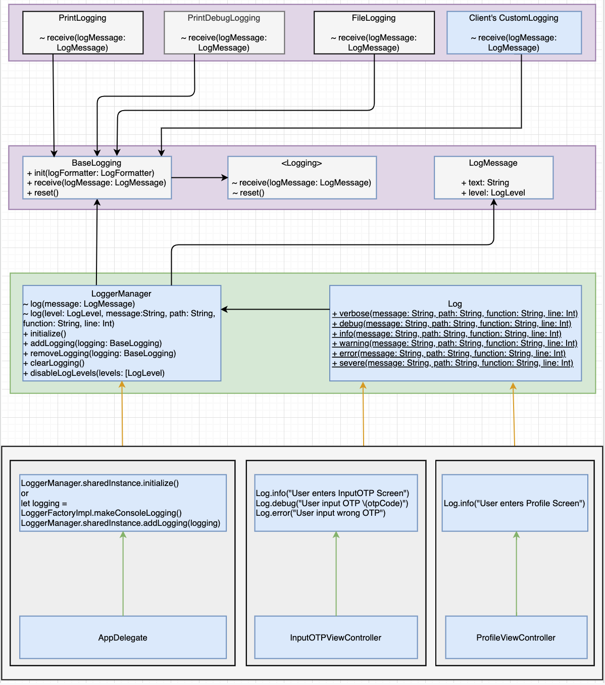

# swift-log

This repo supports Swift's logging

1. Console Logging
2. File Logging and sync each configurable timeInterval

## Log Level supports

1. 🗣 Verbose: A verbose message, usually useful when working on a specific problem
2. 🔍 Debug: A debug message that may be useful to a developer
3. ℹ️ Info: An info message that highlight the progress of the application at coarse-grained level.
4. ⚠️ Warning: A warning message, may indicate a possible error
5. ❗️ Error: An error occurred, but it's recoverable, just info about what happened
6. 🛑 Severe: A server error occurred

## Requirements
- Xcode 11+
- Swift 5.0+

## How
### Setup
1. Use Framework's default setup
```
import UIKit
import Logging

@UIApplicationMain
class AppDelegate: UIResponder, UIApplicationDelegate {
    func application(_ application: UIApplication, didFinishLaunchingWithOptions launchOptions: [UIApplication.LaunchOptionsKey: Any]?) -> Bool {
        // Override point for customization after application launch.
        /// Setup Logging
        LoggerManager.sharedInstance.initialize()
        return true
    }
}
```
2. Use supported Loggings
```
import UIKit
import Logging

@UIApplicationMain
class AppDelegate: UIResponder, UIApplicationDelegate {
    func application(_ application: UIApplication, didFinishLaunchingWithOptions launchOptions: [UIApplication.LaunchOptionsKey: Any]?) -> Bool {
        /// Setup Logging
        let logFormatter = LogFormatterImpl()
        LoggerManager.sharedInstance.addLogging(LoggerFactoryImpl.makeConsoleLogging(logFormatter: logFormatter))
        LoggerManager.sharedInstance.addLogging(LoggerFactoryImpl.makeFileLogging(fileName: "logs"))
        /// Disable LogLevels. Enable all LogLevels by default
        LoggerManager.sharedInstance.disableLogLevels([LogLevel.info, LogLevel.error])

        return true
    }
}
```
3. Add your custom Logging
```
import UIKit
import Logging

@UIApplicationMain
class AppDelegate: UIResponder, UIApplicationDelegate {
    func application(_ application: UIApplication, didFinishLaunchingWithOptions launchOptions: [UIApplication.LaunchOptionsKey: Any]?) -> Bool {
        // Override point for customization after application launch.
        /// Setup Logging
        let logFormatter = LogFormatterImpl()
        let testLogging = TestLogging(logFormatter: logFormatter)
        LoggerManager.sharedInstance.addLogging(testLogging)
        return true
    }
}

/// Your custom Logging.
final class TestLogging: BaseLogging {
    override func receiveMessage(_ message: LogMessage) {
        if let formattedMessage = logFormatter?.formatMessage(message) {
            print(formattedMessage)
            print("Add your more logic here if you want")
        } else {
            print("Add your logic to handle this message: \(message.text)")
        }
    }
}
```
4. Add your custom Formatter
```
import UIKit
import Logging

@UIApplicationMain
class AppDelegate: UIResponder, UIApplicationDelegate {
    func application(_ application: UIApplication, didFinishLaunchingWithOptions launchOptions: [UIApplication.LaunchOptionsKey: Any]?) -> Bool {
        // Override point for customization after application launch.
        /// Setup Logging
        let logFormatter = CustomLoggingFormatter()
        let testLogging = LoggerFactoryImpl.makeConsoleLogging(logFormatter: logFormatter)
        LoggerManager.sharedInstance.addLogging(testLogging)
        return true
    }
}

/// Your custom Formatter
final class CustomLoggingFormatter: LogFormatter {
    func formatMessage(_ message: LogMessage) -> String {
        return "[\(message.level.symbol)][\(message.function)] -> \(message.text)"
    }
}
```
### Use
```
/// Invoke
Log.info(message: "info")
Log.debug(message: "debug")
Log.verbose(message: "verbose")
Log.warning(message: "warning")
Log.error(message: "error")
Log.severe(message: "severe")

/// Output
2020-07-16T18:50:09.254+0700 [ℹ️][ViewController.swift:18:viewDidLoad()] -> info
2020-07-16T18:50:09.256+0700 [🔍][ViewController.swift:19:viewDidLoad()] -> debug
2020-07-16T18:50:09.256+0700 [🗣][ViewController.swift:20:viewDidLoad()] -> verbose
2020-07-16T18:50:09.257+0700 [⚠️][ViewController.swift:21:viewDidLoad()] -> warning
2020-07-16T18:50:09.257+0700 [❗️][ViewController.swift:22:viewDidLoad()] -> error
2020-07-16T18:50:09.257+0700 [🛑][ViewController.swift:23:viewDidLoad()] -> severe
```

## Installation

There are three ways to install `swift-log`

### CocoaPods

Just add to your project's `Podfile`:

```
pod 'Logging', :git => 'https://github.com/lengocduy/swift-log.git'
```

### Carthage

Add following to `Cartfile`:

```
github "lengocduy/swift-log"
```

### Swift Package Manager

Create a `Package.swift` file:

```
// swift-tools-version:5.0

import PackageDescription

let package = Package(
        name: "TestLogging",

        dependencies: [
            .package(url: "https://github.com/lengocduy/swift-log.git", from: "1.0.0"),
        ],

        targets: [
            .target(
                    name: "TestLogging",
                    dependencies: ["Logging"])
        ]
)

```

## Architecture


## Interaction Flow
