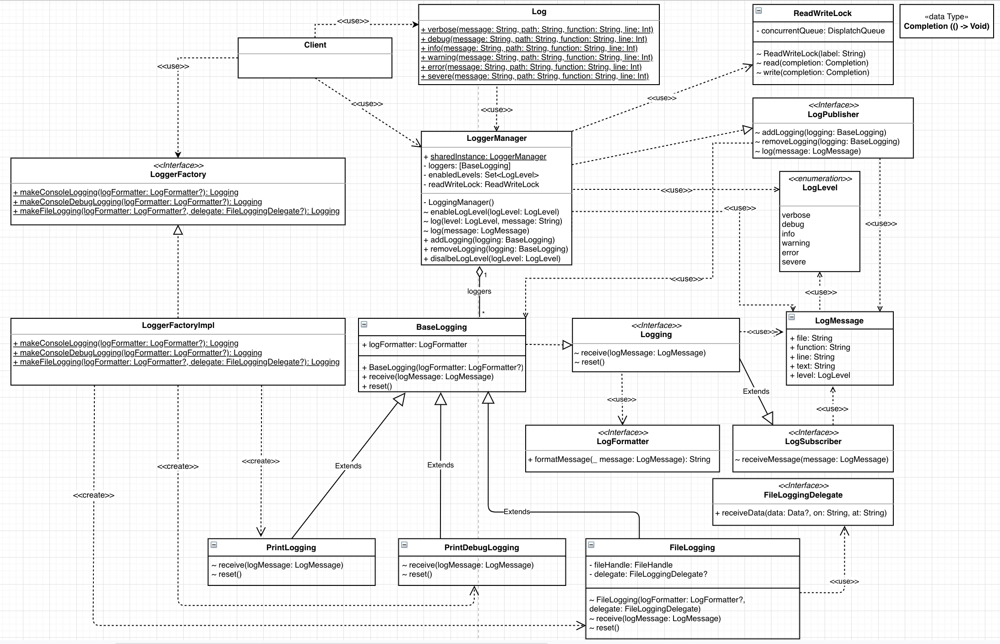

# swift-log

This repo supports logging in iOS

1. Console Logging
2. File Logging and sync each configurable timeInterval

## Log Level supports

1. 🗣 Verbose: A verbose message, usually useful when working on a specific problem
2. 🔍 Debug: A debug message that may be useful to a developer
3. ℹ️ Info: An info message that highlight the progress of the application at coarse-grained level.
4. ⚠️ Warning: A warning message, may indicate a possible error
5. ❗️ Error: An error occurred, but it's recoverable, just info about what happened
6. 🛑 Severe: A server error occurred

## Prerequisite

- *[SwiftLint](https://github.com/realm/SwiftLint)* enforce Swift style and conventions. Install via Homebrew: ```$ brew install swiftlint```
- *Standardize* development mode ```$ ./Scripts/setup.sh```

## Installation

There are two ways to install `swift-log`

### CocoaPods

Just add to your project's `Podfile`:

```
github "lengocduy/swift-log"
```

### Carthage

Add following to `Cartfile`:

```
github "lengocduy/swift-log"
```

## Architecture

